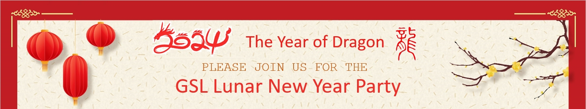

## GSL 2024 Lunar New Year Party
PLEASE JOIN US FOR THE ***GSL Lunar New Year Party*** on ***9 February 2024 11:30-1:00*** at GC402.   
2024 is the year of 龙 (pronounced as Long), starting from February 10th, 2024 (NOTE: GSL’s party is right on New Year’s Eve). The Dragon symbolizes power, nobleness, honor, luck, and success in traditional Chinese culture. The Dragon is a supernatural being with no parallel for talent and excellence.

[Sign up to bring something for a potluck](https://docs.google.com/spreadsheets/d/1MgadHpuhwh-IwcJWfkpAhIAsYv6aZk8iYVvSgBYJUBM)

[Tentative Party Agenda](https://docs.google.com/document/d/1pDa07tzxj-asaPtt83nAf40UWPmyHzQjqZEVOIivbB4/)
   
[Optional Reading Material before the party](https://docs.google.com/presentation/d/1FFU5KUS43Icl3BJNRjeHd9m27MCh94lidkhIoNl-8kA/)

Hosted by: GSL DEIA council, CIRES DEI program,    
Shan Sun, Guoqing Ge, Ming Hu, Kate Zhang,    
Man Zhang, Suneng Zhuo, Chunhua Zhou, Ruifang Li   
